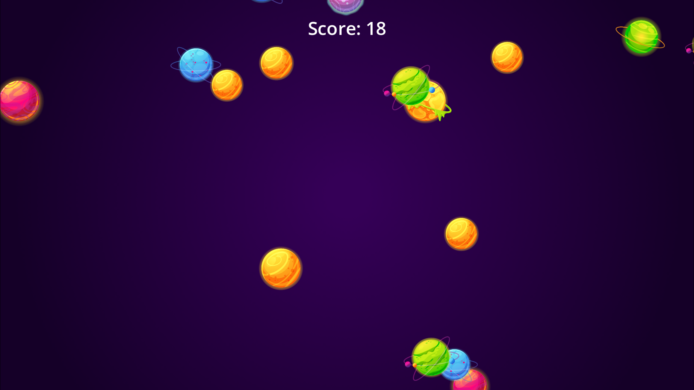
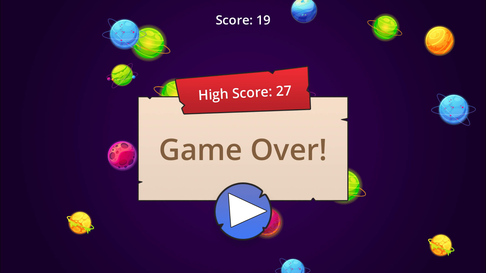

# Shooting Planets Survival

---

A small fast reflex game.
Move your mouse, dodge the flying balls, and see how long you can last.

## 🧩 Info

- **Engine:** Godot 4.5
- **Language:** GDScript
- **Purpose:** this was made as a test for https://ziva.sh/ (AI Godot editor)
- **Work time:** 1h:23m

---

## 🕹️ How To Play

- Planet balls keep flying across the screen from random directions.
- If a ball touches your mouse → **Game Over**.
- Your score goes up once every second you survive.
- Click anywhere to restart and try again to reach higher **High Score**.

---

## ⚙️ Game Rules

- Planet balls start off-screen and move straight across.
- Each ball has a random color and random size (up to 50% difference).
- At the start, they cross the screen in about 10 seconds.
- They spawn twice per second at first.
- The longer you survive, the faster and more frequent they become.
